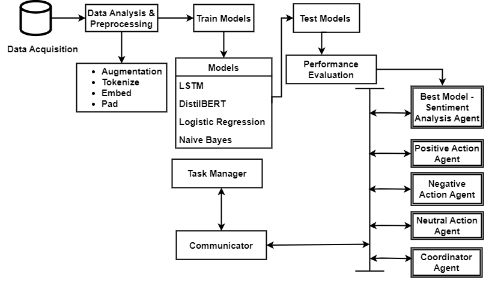
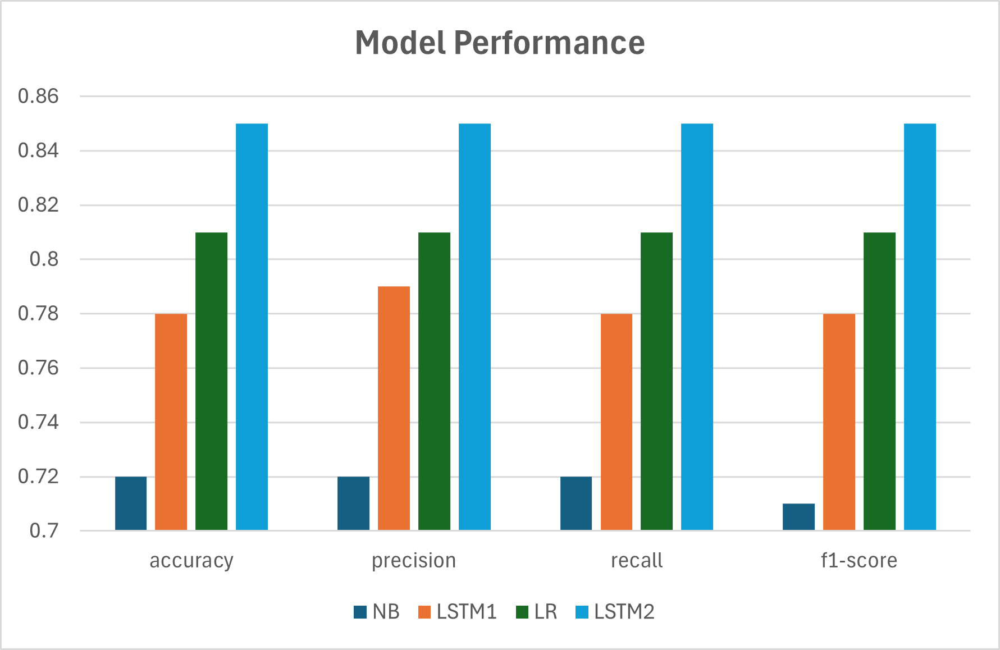
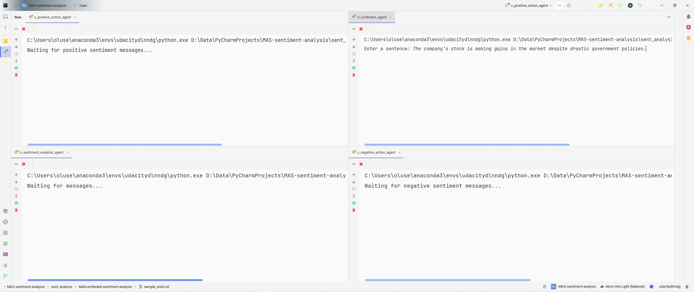
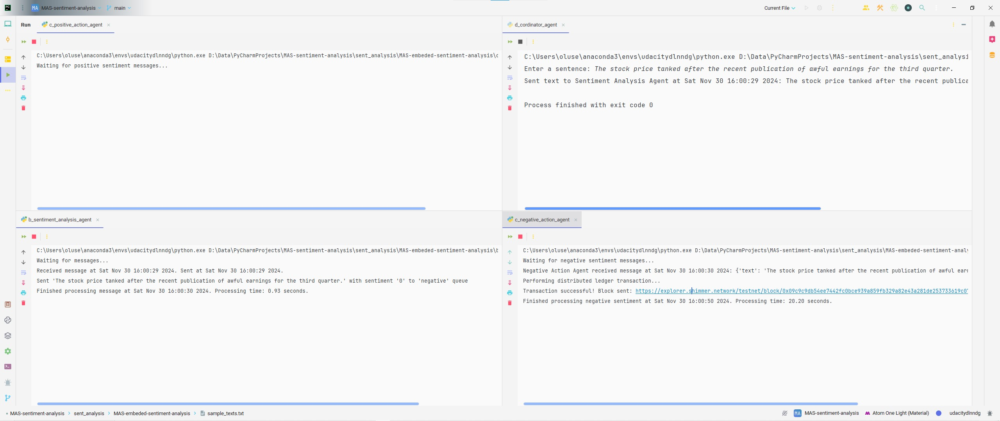
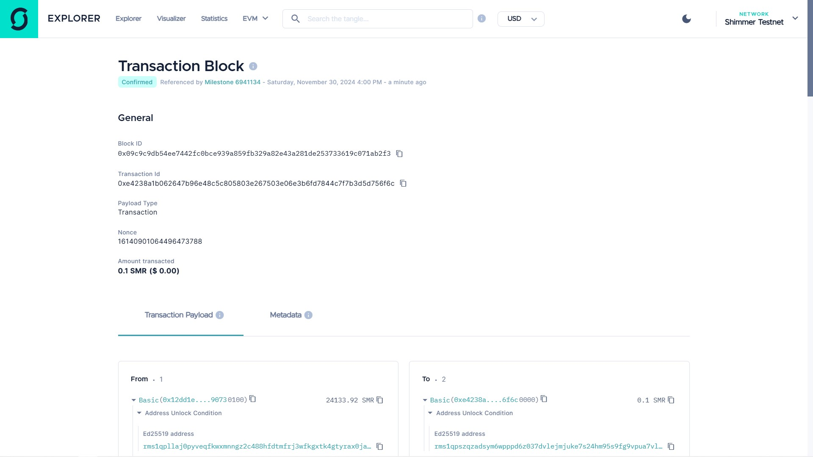
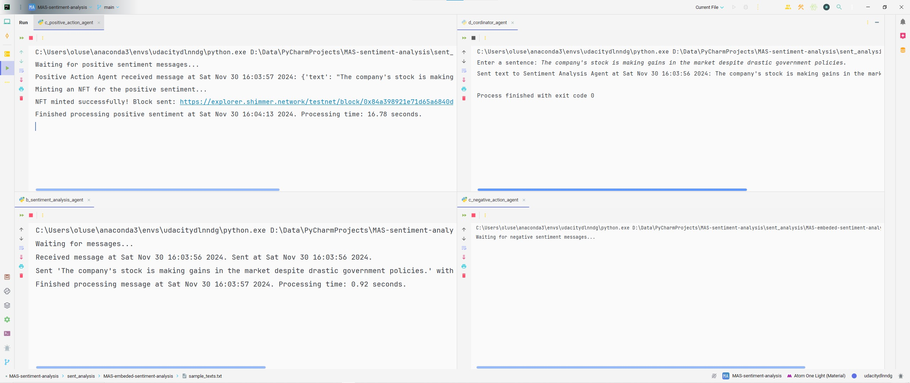
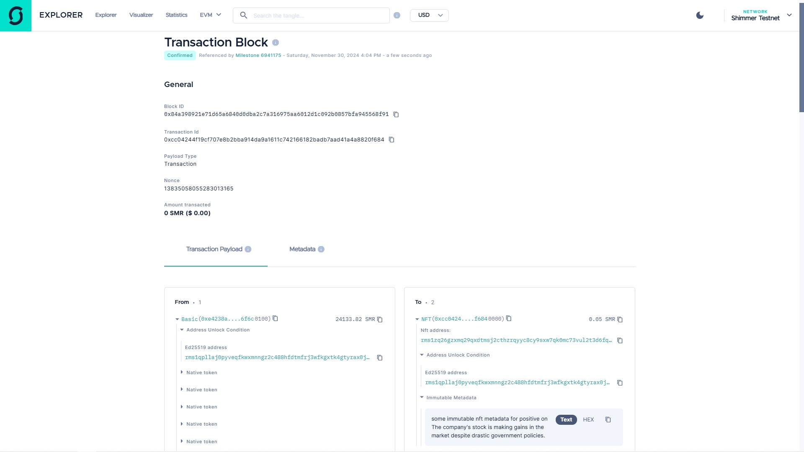

# Development of a Scalable Multi-Agent System for Financial Sentiment Analysis Using RabbitMQ
---

This project is a **Multi-Agent System (MAS)** designed to analyze financial sentiment in user-provided text and route
actionable insights to specialized agents based on sentiment. The system uses **RabbitMQ** for communication between
agents and a machine learning model for sentiment analysis, and IOTA SDK for distributed ledger transactions and NFT
minting.

---
## **Table of Contents**

- [Introduction](#introduction)
- [System Architecture](#system-architecture)
- [Features](#features)
- [Prerequisites](#prerequisites)
- [Key Results](#key-results)
- [Setup and Installation](#setup-and-installation)
- [Usage](#usage)
- [Project Structure](#project-structure)
- [Contributing](#contributing)
- [License](#license)
- [Future Improvements](#future-improvements)
- [Acknowledgements](#acknowledgements)
---
## **Introduction**
This project demonstrates a distributed architecture where agents collaborate to process user input efficiently:
- The **Coordinator Agent** collects input from users.
- The **Sentiment Analysis Agent** determines the sentiment (positive, neutral, or negative) using a machine learning model.
- Specialized **Action Agents** perform actions based on the sentiment:
  - **Positive Action Agent**: Handles positive sentiments and **mints NFT** as response action.
  - **Neutral Action Agent**: Handles neutral sentiments. It is considered trivial.
  - **Negative Action Agent**: Handles negative sentiments. It performs a **Distributed Ledger Transaction** as response action.

Agents interact through RabbitMQ, and sentiment is classified using a pre-trained DistilBERT model combined with logistic regression.

Data source: Financial PhraseBank by Malo et al. (2014).

---
## **System Architecture**

The system architecture is given below:


The system comprises the following agents:
1. **Coordinator Agent**:
   - Acts as the user interface.
   - Sends raw text input to the Sentiment Analysis Agent via RabbitMQ.

2. **Sentiment Analysis Agent**:
   - Receives input from the Coordinator.
   - Analyzes sentiment using a pre-trained **DistilBERT** model with logistic regression.
   - Routes the sentiment and text to the appropriate Action Agent.

3. **Action Agents**:
   - **Positive Action Agent**: 
     - Processes and logs positive sentiments.
     - Mints an NFT using the IOTA SDK with metadata describing the sentiment and user-provided text.
   - **Neutral Action Agent**: Processes and logs neutral sentiments.
   - **Negative Action Agent**: 
     - Processes and logs negative sentiments.
     - Performs a distributed ledger transaction using the **IOTA SDK**.

The communication between agents is facilitated by **RabbitMQ**, with messages routed using direct exchanges and routing keys. The system is designed for scalability and extensibility, enabling the addition of more agents or sentiment types as needed.

---
## **Features**

- **Distributed Architecture**: Implements a robust multi-agent system using RabbitMQ for inter-agent communication.
- **Sentiment Analysis**: Leverages a fine-tuned DistilBERT model with a logistic regression classifier.
- **Actionable Insights**: Routes analyzed sentiment to specialized agents for further processing.
- **Distributed Ledger Transactions**: Executes transactions on the IOTA Tangle for negative sentiment.
- **NFT Minting**: Mints NFTs with dynamic metadata for positive sentiment.
- **Dynamic Message Routing**: Routes messages to action agents based on sentiment using RabbitMQ's direct exchanges.
- **Timing Metrics**: Logs timestamps for message receipt and processing completion to monitor performance.
---

## **Prerequisites**

Before running the project, ensure you have:
- Python 3.8 or later
- RabbitMQ installed and running
- IOTA SDK installed (see `readme.txt`)
- A wallet setup for IOTA transactions
- Required Python libraries (see `environment.yaml`)
---
## **Key Results**
The image below shows the performance of the models trained on the financial sentiment analysis. 


### **Agents in Action**
The figure below shows us our IDE with the CoA (coordinator agent) ready to collect inputs and other agents awaiting 
messages in the MAS.

With the input _The stock price tanked after the recent publication of awful earnings for the third quarter._ using 
the CoA, the NegAA (Negative Action Agent) responds accordingly by executing a DLT with the transaction link and 
block ID provided. In this execution, the PAA (Positive Action Agent) and NeuAA (Neutral Action Agent) are uninvolved.

The webpage for the transaction is provided in Figure below. 

With the input _The company's stock is making gains in the market despite drastic government policies._ using the CoA, the PAA responds accordingly by minting an NFT based on the sentiment predicted by the SAA and the text provided by the user with the transaction link and block ID provided. In this execution, the NegAA and NeuAA are uninvolved.

The webpage for the transaction is provided below.

---
## **Setup and Installation**

1. **Clone the Repository**:
   ```bash
   git clone https://github.com/olusegunajibola/MAS-sentiment-analysis.git
   cd MAS-sentiment-analysis
   ```
2. **Install Dependencies**:
    ```bash
   conda env create -f environment.yaml
    ```
3. **Configure Environment Variables**:
    ````text
    WALLET_DB_PATH=path_to_wallet_database
    STRONGHOLD_PASSWORD=your_stronghold_password
    EXPLORER_URL=https://explorer.iota.org
   ````
   You can see `readme.txt` for more instructions.
4. **Start RabbitMQ**: Ensure RabbitMQ is running locally:
    ````bash
    rabbitmq-server
   ````
5. **Run Agents**: Open separate terminals for each agent and execute:
    - **Coordinator Agent**:
    ````python
    python MAS-sentiment-analysis/d_cordinator_agent.py
   ````
    - **Sentiment Analysis Agent**:
    ````python
    python MAS-sentiment-analysis/b_sentiment_analysis_agent.py
   ````
    - **Action Agents**:
    ```python
    python MAS-sentiment-analysis/c_negative_action_agent.py
    python MAS-sentiment-analysis/c_neutral_action_agent.py
    python MAS-sentiment-analysis/c_positive_action_agent.py
   ```
---
## **Usage**
1. **Start All Agents**:
    - Follow the setup instructions to start each agent.
2. **Input Sentences**:
    - Provide a sentence through the Coordinator Agent:
   ```python
    Enter a sentence: Profits have doubled this year!
    ```
3. **Processing**:
   * The system routes the input through the Sentiment Analysis Agent, which determines the sentiment and forwards the message to the appropriate action agent:
     - Negative Sentiment: Executes a distributed ledger transaction.
     - Positive Sentiment: Mints an NFT with dynamic metadata.
4. **Logs**:
    - View logs in each agent's terminal for processing details and actions.
---
## Project Structure
````text
multi-agent-sentiment-analysis/
├── README.md                # Project documentation
├── environment.yaml         # Required Python libraries
├── iota_env/                # IOTA-related functionality
│   ├── __init__.py
│   ├── mint_nft.py          # NFT minting logic
│   ├── simple_transaction.py # Transaction logic
├── MAS/                     # Multi-Agent System components
│   ├── __init__.py
│   ├── a_connection.py      # RabbitMQ connection utility
│   ├── d_cordinator_agent.py # Coordinator agent
│   ├── b_sentiment_analysis_agent.py # Sentiment Analysis Agent
│   ├── c_negative_action_agent.py # Negative Action Agent
│   ├── c_neutral_action_agent.py  # Neutral Action Agent
│   ├── c_positive_action_agent.py # Positive Action Agent
├── models/                  # Pre-trained models
│   ├── DB.pth               # DistilBERT model
│   ├── logistic_regression_model.pkl # Logistic regression model
└── utils/                   # Optional utility scripts
````
---
## **Contributing**
Contributions are welcome! To contribute:

1. Fork the repository.
2. Create a new branch (`git checkout -b feature-name`).
3. Commit changes (`git commit -m 'Add feature'`).
4. Push to the branch (`git push origin feature-name`).
5. Open a pull request.
---
## **License**
This project is licensed under the Apache-2.0 License. See `LICENSE` for details.

---
## **Future Improvements**
* Support sentiment analysis in multiple languages.
* Integrate real-time input streams (e.g., Twitter API).
* Extend NFT metadata for richer content.
* Implement more advanced action agents (e.g., notifications or trading bots).
---
## **Acknowledgements**
This project was carried out as a part of the requirement in fulfilment of the achievement of a master's degree in 
Applied Data Science at the [Department of Engineering and Computer Science and Mathematics (DISIM)](https://www.disim.univaq.it/) of the [University of L'Aquila](https://www.univaq.it/) under the supervision of Prof. [Giovanni 
De Gasperis](https://www.disim.univaq.it/GiovanniDeGasperis).

---


